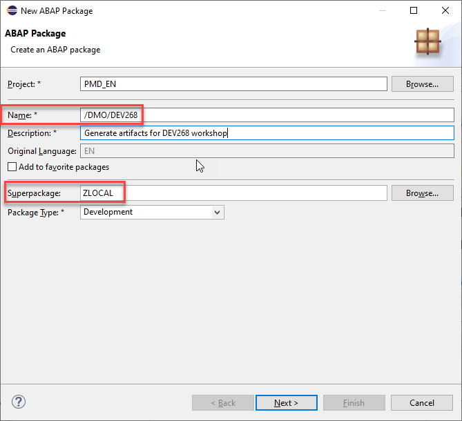
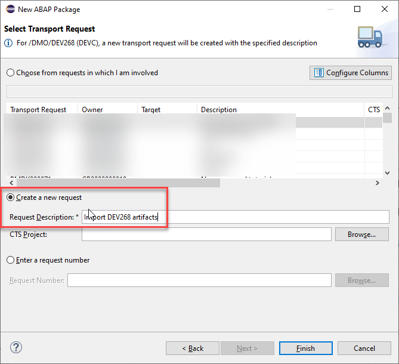
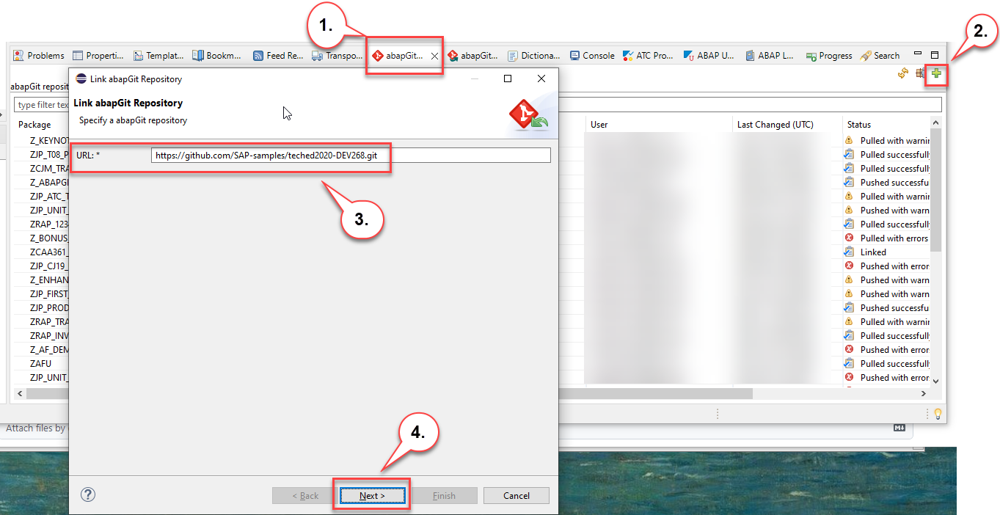
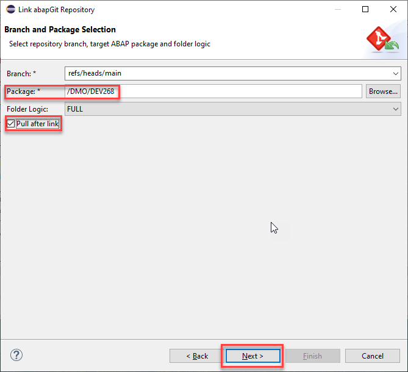
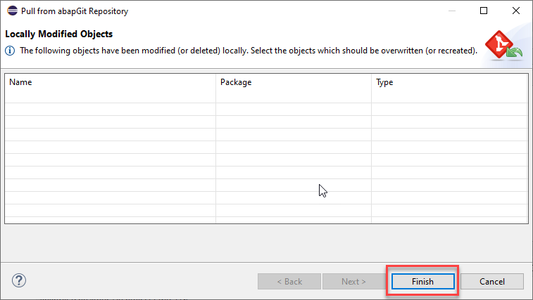
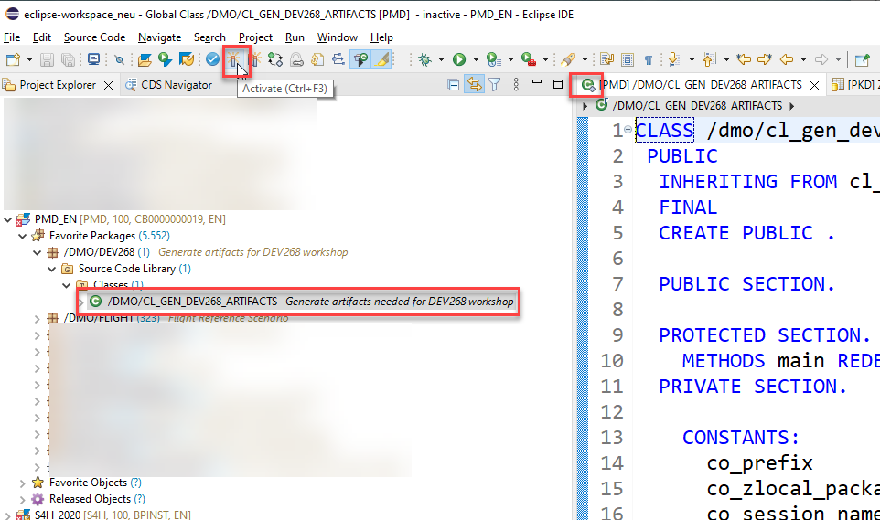

## Import of the helper class /dmo/cl_gen_dev268_artifacts

When you are running this mission in your own Steampunk system you have to 

1. import the helper class /dmo/cl_gen_dev268_artifacts and you have to 
2. import the RAP Generator https://github.com/SAP-samples/cloud-abap-rap 

### Create a package /DMO/DEV268

1. Create a package with the name **/DMO/DEV268** and choose **ZLOCAL** as the super package.

 

and create a new transport request.   

    

### Link package to ABAP Git repository

1. Click on the tab **abapGit Repositories**
2. Click on the **green plus sign** on right hand side
3. Enter the following URL https://github.com/SAP-samples/teched2020-DEV268.git
4. Press **Next**

 

1. In the next screen enter the name of the package that you have created in the first step **/DMO/DEV268**.
2. Mark the check box **Pull after link**
3. Press **Next**

 

In the screen **Select Transport Request** select the transport request thatpress **Finish**   

In the screen **Pull from abapGit Repository** select **Finish**

    
 
Navigate to the imported class **/dmo/cl_gen_dev268_artifacts** and press **Activate**  

   
  
  

